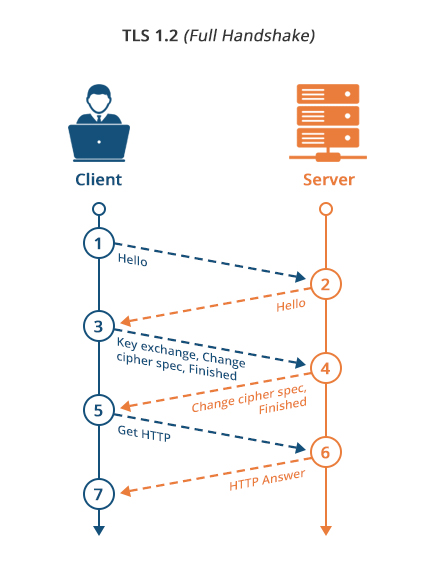

# Cryptographic algorithms and protocols

A self-study project where I have implemented some simple cryptographic algorithms and protocols, all the way from the [number theoretic foundations](./number_theory) to the actual algorithm. 

- Random Prime generation in O(n log log n) time, using the [Sieve of Eratosthenes](https://en.wikipedia.org/wiki/Sieve_of_Eratosthenes).
- [Modular multiplicative inverse](https://en.wikipedia.org/wiki/Modular_multiplicative_inverse) using [Extended Euclidean Algorithm](https://en.wikipedia.org/wiki/Extended_Euclidean_algorithm) running in O(log(min(n, modulo)) time, used in the implementation of [RSA encryption](./key_exchange/rsa.py).
- [Diffie-Hellman](https://en.wikipedia.org/wiki/Diffie%E2%80%93Hellman_key_exchange) key exchange.
- [XOR cipher](https://en.wikipedia.org/wiki/XOR_cipher) for symmetric encryption. 

## TLS -ish

  

The end goal is to implement a minimal example of something similar to the [TLS protocol](https://datatracker.ietf.org/doc/html/rfc5246) using [Diffie-Helman](./key_exchange/diffie_hellman.py) for initial key exchange and [RSA](./key_exchange/rsa.py) for symmetric encryption. 

The current progress is a [client](tls_ish/client.py) and [server](tls_ish/server.py) sending encrypted strings to each other over a TCP socket adn decrypting on arrival.
